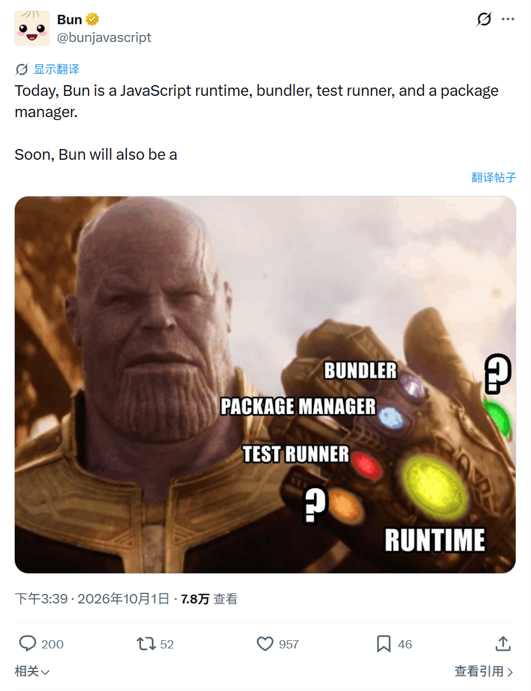
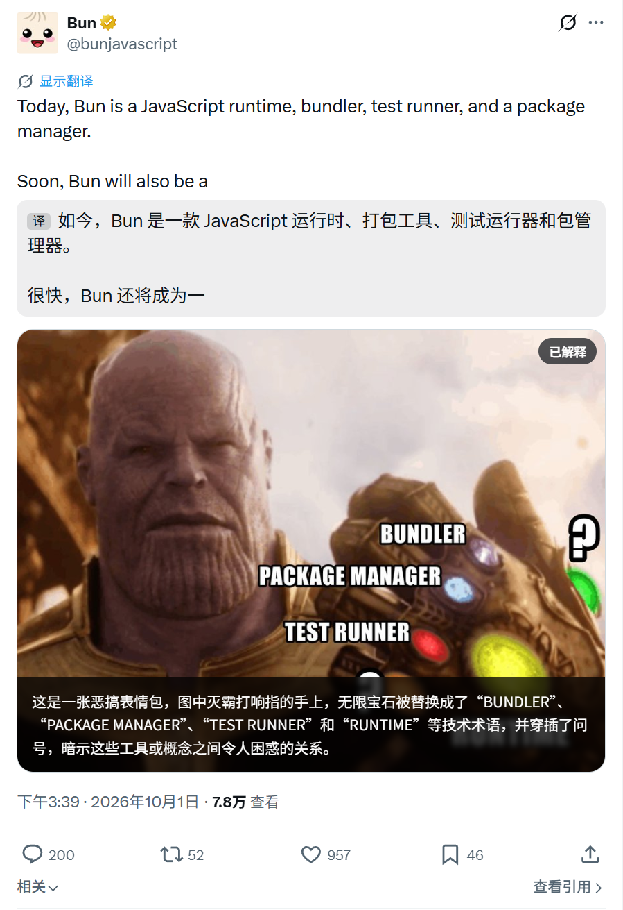
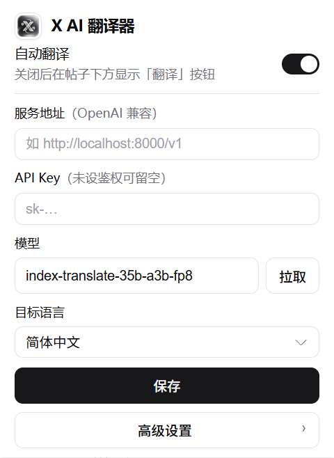
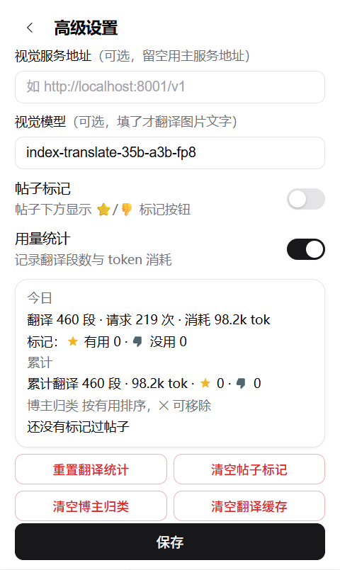
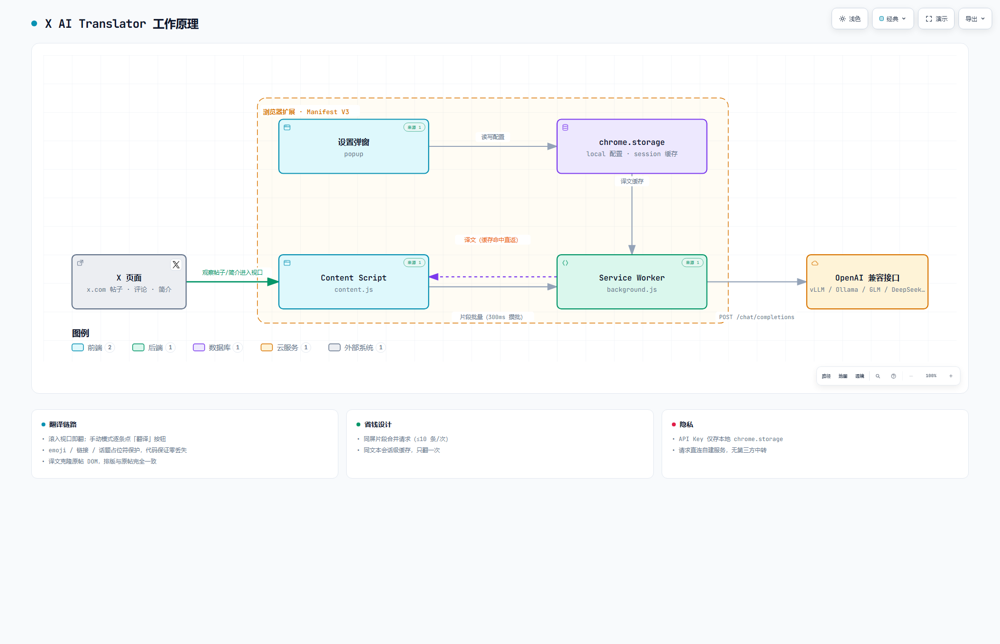

# X AI Translator

> 🌐 刷 X(Twitter) 时，外语帖子、评论和个人主页简介自动翻译成中文——翻译由**你自己的 AI 服务**完成，不经任何第三方中转。

浏览器扩展（Chrome / Edge，Manifest V3，零依赖、免构建）。译文以「克隆原帖 DOM」的方式显示在原文下方：链接、换行、富文本、字号与原帖完全一致，只把文字换成译文。

## ✨ 特性

- **覆盖全面**：时间线、帖子详情、评论、引用、个人主页简介（bio）、资料卡片
- **双模式**：自动翻译（滚入视口即翻，提前预取）；或在设置里关闭后切换为手动——帖子底部右下角出现「翻译」按钮，逐条按需翻译
- **自带引擎**：支持任意 OpenAI 兼容接口——vLLM / Ollama / DeepSeek / 智谱 GLM / OpenAI / Gemini 兼容网关……
- **像素级一致的排版**：译文直接克隆原帖 DOM 元素，只替换文字节点——链接（原生样式、可点击）、换行、加粗、字号全部与原帖相同
- **零丢失的占位符保护**：emoji / URL / @提及 / #话题 不进模型，由代码保证原位复刻；模型吞掉占位符时自动补回
- **省钱**：按文本节点切片段批量合并请求；同文本只翻一次（会话级缓存）
- **多语言**：英/日/韩/法/德/俄/阿拉伯语等任意非目标语言都会翻译；中文内容（含假名/谚文精确检测）自动跳过
- **体验闭环**：翻译中显示加载动画；失败显示红字、点击重试；点「显示更多」展开全文后自动重翻
- **隐私**：API Key 只存在本地 `chrome.storage`，翻译请求从扩展后台直连你的服务，不经过任何第三方

## 📸 使用效果

**帖子与图片翻译** —— 译文按原帖排版贴在原文下方；任何图片都可「解释图片」，视觉模型解读内容后以黑底白字面板覆在图片上，再点一下切回原图

<p align="center">
  
  
</p>

**设置面板** —— 主视图只保留连接必需项；帖子标记、用量统计与数据管理收在高级设置

<p align="center">
  
  
</p>

## 🔧 环境要求

- 桌面版 Chrome 或 Edge（Chromium 内核）
- 一个可访问的 OpenAI 兼容 AI 服务（如自建 vLLM）

## 📦 安装

1. Clone 或下载本仓库（或从 [Releases](https://github.com/muerzy/x-ai-auto-translator/releases) 下载 zip 解压）
2. 打开 `chrome://extensions`（Edge 为 `edge://extensions`），右上角开启**开发者模式**
3. 点击**加载已解压的扩展程序**，选择仓库目录（zip 则选解压目录）
4. 打开 [x.com](https://x.com)，点击工具栏图标完成配置

## ⚙️ 配置

| 字段 | 说明 | vLLM 示例 |
|---|---|---|
| 自动翻译 | 勾选=滚入视口自动翻译；取消勾选=帖子底部显示「翻译」按钮手动触发 | — |
| 服务地址 | OpenAI 兼容 baseURL | `http://localhost:8000/v1` |
| API Key | 服务未开启鉴权可留空 | `vllm serve <model> --api-key sk-xxx` 对应的 key |
| 模型 | 点「拉取」可直接从服务获取模型列表 | 部署时的模型名 |
| 目标语言 | 默认简体中文，可选繁体/英/日/韩 | — |

## 🧠 工作原理

<p align="center">
  
</p>

<p align="center"><sub>📈 <a href="docs/architecture.html">交互版架构图</a>（可缩放 / 搜索 / 聚焦，含明暗主题）</sub></p>

一句话流程：**Content Script** 观察 x.com 页面，帖子/简介滚入视口后按 DOM 文本节点切片段，批量（300ms 攒批）发给 **Service Worker**；后者用占位符保护 emoji/链接/话题、合并请求（≤10 条/次）调用 OpenAI 兼容接口并做会话缓存，批量失败自动降级逐条重试；译文返回后**克隆原帖 DOM、仅替换文字节点**，排版与原帖完全一致。

选择器使用 X 的 `data-testid` 稳定锚点（class 名是随机生成的，不可靠）；虚拟滚动回收 DOM 后重新挂载的推文会命中缓存，不产生重复请求。

## ❓ 常见问题

<details>
<summary><b>翻译失败（红字）</b></summary>

点击红字重试；悬停可查看具体错误（401 = key 错误，404 = 服务地址错误，超时 = 服务未启动）。
</details>

<details>
<summary><b>只想翻译个别帖子，不想全自动</b></summary>

在扩展弹窗里取消勾选「自动翻译」，帖子底部右下角会出现「翻译」按钮，点了才翻。
</details>

<details>
<summary><b>换了模型，译文没变化</b></summary>

译文有会话级缓存（同一文本不重复请求），重启浏览器即清空。
</details>

<details>
<summary><b>X 改版后不生效</b></summary>

扩展依赖 `data-testid="tweetText"` 等锚点，X 大改版更换它们时需要更新选择器。
</details>

<details>
<summary><b>本地 vLLM 是 http 地址，会有跨域问题吗</b></summary>

不会。请求由扩展后台（service worker）发起，不受页面 CORS/CSP 限制，`http://localhost` 可直接使用。
</details>

<details>
<summary><b>重载扩展后控制台报 "Extension context invalidated"</b></summary>

旧页面上残留的旧版脚本会自动静默停摆，刷新 x.com 页面即可恢复。
</details>

## 📁 目录结构

```
manifest.json          扩展清单（MV3）
background.js          service worker：调 AI 接口、占位符保护、批量合并、缓存、降级重试
content/content.js     页面脚本：发现推文/简介、视口检测、片段翻译、DOM 克隆渲染译文
content/content.css    译文/按钮/加载动画样式（明暗主题自适应）
popup/                 设置弹窗（模式开关 / 服务地址 / key / 模型 / 目标语言）
docs/                  架构图（archify 生成的交互式 HTML + PNG + 规格 JSON）
icons/                 扩展图标
screenshots/           README 截图
make-icons.ps1         图标生成脚本（换图标时改路径重跑）
```

## ⚠️ 已知限制

- X 前端改版较频繁，极端情况下需跟随更新选择器（此类插件的普遍维护成本）
- API 费用自理；调用量由片段批量合并与会话缓存缓解
