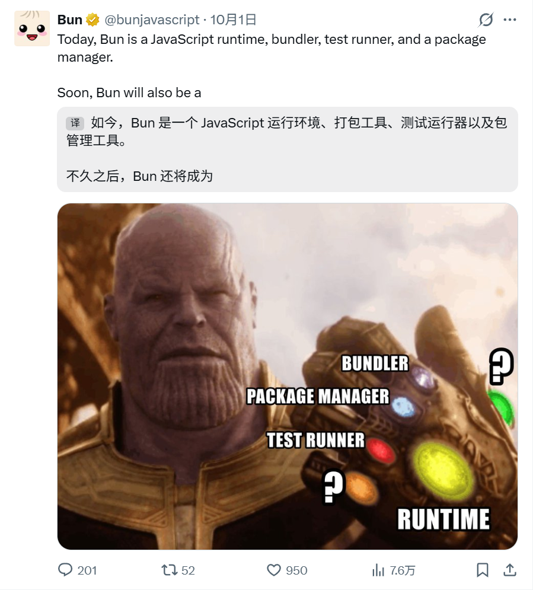
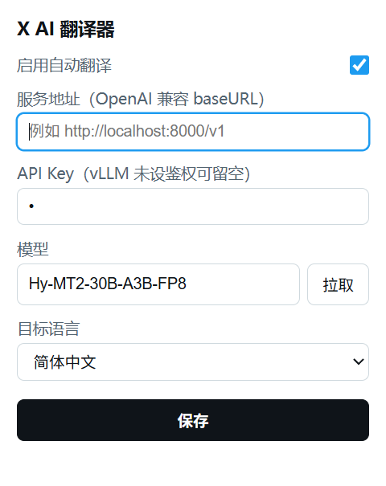

# X AI Translator

> 🌐 刷 X(Twitter) 时，外语帖子和评论自动翻译成中文——翻译由**你自己的 AI 服务**完成，不经任何第三方中转。

浏览器扩展（Chrome / Edge，Manifest V3，零依赖、免构建）。译文以浅色背景块显示在原文下方，样式跟随 X 的明暗主题与原帖排版。

## ✨ 特性

- **纯自动**：推文滚入视口即翻译（提前预取，滚动顺滑），无需手动点击
- **自带引擎**：支持任意 OpenAI 兼容接口——vLLM / Ollama / DeepSeek / 智谱 GLM / OpenAI / Gemini 兼容网关……
- **省钱**：同屏多条推文合并成一次请求（默认 10 条/批）；同一文本只翻译一次（页面内去重 + 会话级缓存）
- **贴合推特语境**：保留 @提及 / URL / emoji / 换行分段；俚语、缩写、梗优先翻译成地道表达，必要处加简短注释
- **富文本还原**：译文里的 URL、@提及、#话题渲染成 X 链接蓝，可点击跳转
- **聪明的跳过**：中文推文自动跳过（`lang` 属性 + CJK 字符占比双重检测）
- **长文友好**：点击「显示更多」展开全文后，自动重新翻译完整内容
- **明暗自适应**：译文样式跟随 X 亮色 / 暗色主题
- **隐私**：API Key 只存在本地 `chrome.storage`，翻译请求从扩展后台直连你的服务，不经过任何第三方

## 📸 使用效果

<p align="center">
  
</p>
<p align="center">
  
</p>

## 🔧 环境要求

- 桌面版 Chrome 或 Edge（Chromium 内核）
- 一个可访问的 OpenAI 兼容 AI 服务（如自建 vLLM）

## 📦 安装

1. Clone 或下载本仓库
2. 打开 `chrome://extensions`（Edge 为 `edge://extensions`），右上角开启**开发者模式**
3. 点击**加载已解压的扩展程序**，选择本仓库目录
4. 打开 [x.com](https://x.com)，点击工具栏图标完成配置

## ⚙️ 配置

| 字段 | 说明 | vLLM 示例 |
|---|---|---|
| 服务地址 | OpenAI 兼容 baseURL | `http://localhost:8000/v1` |
| API Key | 服务未开启鉴权可留空 | `vllm serve <model> --api-key sk-xxx` 对应的 key |
| 模型 | 点「拉取」可直接从服务获取模型列表 | 部署时的模型名 |
| 目标语言 | 默认简体中文，可选繁体/英/日/韩 | — |

## 🧠 工作原理

```
x.com 页面                          扩展后台 (service worker)
──────────                          ──────────────────────
MutationObserver 发现新推文
  (data-testid="tweetText")
        │
IntersectionObserver 视口检测
        │
批量队列 (300ms 攒批) ──发消息──▶  查会话缓存（命中直接返回）
                                    │ 未命中
                                    ▼
译文插入原文下方          ◀──────  合并请求（≤10 条/次）→ OpenAI 兼容接口
                                  批量解析失败 → 自动降级逐条重试
                                  翻译结果写入会话缓存
```

选择器使用 X 的 `data-testid` 稳定锚点（class 名是随机生成的，不可靠）；虚拟滚动回收 DOM 后重新挂载的推文会命中缓存，不产生重复请求。

## ❓ 常见问题

<details>
<summary><b>翻译失败（红字）</b></summary>

点击红字重试；悬停可查看具体错误（401 = key 错误，404 = 服务地址错误，超时 = 服务未启动）。
</details>

<details>
<summary><b>换了模型，译文没变化</b></summary>

译文有会话级缓存（同一文本不重复请求），重启浏览器即清空。
</details>

<details>
<summary><b>X 改版后不生效</b></summary>

扩展依赖 `data-testid="tweetText"` 锚点，X 大改版更换它时需要更新选择器。
</details>

<details>
<summary><b>本地 vLLM 是 http 地址，会有跨域问题吗</b></summary>

不会。请求由扩展后台（service worker）发起，不受页面 CORS/CSP 限制，`http://localhost` 可直接使用。
</details>

<details>
<summary><b>重载扩展后控制台报 "Extension context invalidated"</b></summary>

旧页面上残留的旧版脚本会自动静默停摆，刷新 x.com 页面即可恢复。
</details>

## 📁 目录结构

```
manifest.json          扩展清单（MV3）
background.js          service worker：调 AI 接口、批量合并、缓存、降级重试
content/content.js     页面脚本：发现推文、视口检测、富文本渲染译文
content/content.css    译文样式（明暗主题自适应）
popup/                 设置弹窗（服务地址 / key / 模型 / 目标语言 / 开关）
icons/                 扩展图标
screenshots/           README 截图
make-icons.ps1         图标生成脚本（换图标时改路径重跑）
```

## ⚠️ 已知限制

- X 前端改版较频繁，极端情况下需跟随更新选择器（此类插件的普遍维护成本）
- API 费用自理；自动翻译模式调用量由批量合并与会话缓存缓解
